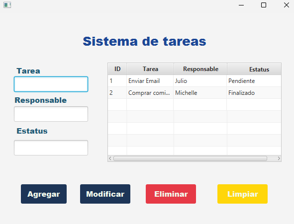

# 📝 Sistema de Gestión de Tareas

Aplicación de escritorio desarrollada con **JavaFX y Spring Boot** que permite gestionar tareas mediante operaciones CRUD (Crear, Leer, Actualizar y Eliminar).

---

## 🚀 Características

- 📋 Visualización de tareas en tabla
- ➕ Agregar nuevas tareas
- ✏️ Modificar tareas existentes
- ❌ Eliminar tareas
- 🧹 Limpiar campos del formulario
- 👤 Asignación de responsables
- 📌 Gestión de estatus (Pendiente / Finalizado)

---

## 🛠️ Tecnologías utilizadas

- Java 17+
- JavaFX
- Spring Boot
- Spring Data JPA
- Maven
- MySQL 
- Scene Builder (para diseño de interfaz)

---

## 📂 Estructura del proyecto
```bash
└── 📁src
    └── 📁main
        └── 📁java
            └── 📁cursojava
                └── 📁tareas
                    └── 📁controlador
                        ├── IndexControlador.java
                    └── 📁modelo
                        ├── Tarea.java
                    └── 📁presentacion
                        ├── SistemasTareasFx.java
                    └── 📁repositorio
                        ├── TareaRepositorio.java
                    └── 📁servicio
                        ├── ITareaServicio.java
                        ├── TareaServicio.java
                    ├── TareasApplication.java
        └── 📁resources
            └── 📁templates
                ├── index.fxml
            ├── application.properties
            ├── logback-spring.xml
    └── 📁test
        └── 📁java
            └── 📁cursojava
                └── 📁tareas
                    └── TareasApplicationTests.java
```

## 📌 Funcionalidades principales

| Función  | Descripción                           |
| -------- | ------------------------------------- |
| Listar   | Muestra todas las tareas en la tabla  |
| Crear    | Permite registrar una nueva tarea     |
| Editar   | Actualiza la información de una tarea |
| Eliminar | Borra una tarea del sistema           |
| Limpiar  | Resetea los campos del formulario     |

## 🎯 Arquitectura

El proyecto sigue una arquitectura en capas:

  -Controller → Manejo de eventos JavaFX
  -Service → Lógica de negocio
  -Repository → Acceso a datos (JPA)
  -Model → Entidades

## 📸 Capturas del sistema

### 🏠 Vista principal


---

## ⚙️ Instalación y ejecución

### 1. Clonar el repositorio
```bash
git clone https://github.com/TU-USUARIO/sistema-tareas.git
cd sistema-tareas
```

### 2. Ejecutar el proyecto
```bash
./mvnw spring-boot:run

o en windows:

mvnw.cmd spring-boot:run
```

### 🖥️ Uso del sistema

1. Ingresa la información de la tarea:
  -Tarea
  -Responsable
  -Estatus
   
2. Usa los botones:
  -Agregar → Guarda nueva tarea
  -Modificar → Actualiza tarea seleccionada
  -Eliminar → Borra tarea
  -Limpiar → Limpia los campos

## 👨‍💻 Autor

Julio Iván Pérez Romero
📚 Estudiante de Ingeniería en Sistemas Computacionales

